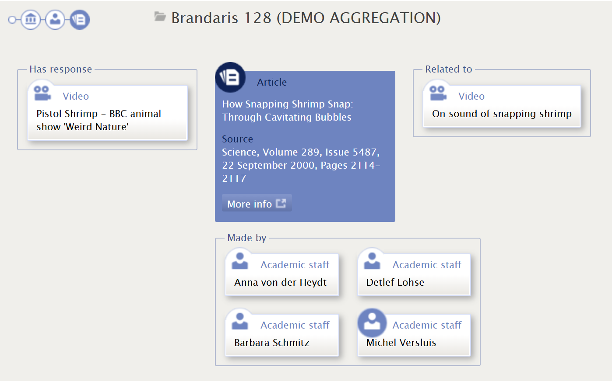

rdf-InContext
=============

[](https://doi.org/10.5281/zenodo.21511995)
[](https://surf-ori.github.io/incontext/)

**Live demo:** <https://surf-ori.github.io/incontext/>

InContext lets you navigate through RDF relations in a smooth and understandable way. The objects in an Enhanced Publication are presented like a newspaper cloud — click any item to move it to the centre and explore its related resources. The visualiser is lightweight, friendly, and creates information scent for discovery.

[](https://surf-ori.github.io/incontext/)

## About

rdf-InContext is a client-side JavaScript visualisation widget for [Enhanced Publications](https://en.wikipedia.org/wiki/Enhanced_publication) — compound scholarly objects that link publications to research datasets, images, and other resources via [OAI-ORE](https://www.openarchives.org/ore/) RDF.

Originally developed in 2011–2013 for [SURFfoundation](https://www.surf.nl/) as part of the SURFshare programme. Deployed in production in the [NARCIS](https://www.narcis.nl/) Dutch national research portal and the University of Twente ESCAPE project.

This repository revives the original source under the [surf-ori](https://github.com/surf-ori) organisation, with a live GitHub Pages demo and long-term archival on Zenodo.

## Features

- Lightweight client-side JavaScript — no server required for the visualisation
- Interactive cloud layout: click any node to navigate; browser URL updates for deep-linking
- Configurable property labels, type icons, and OWL inverse/symmetric relation support
- Modular sandbox architecture (Nicholas Zakas pattern) — modules are swappable
- History manager can be disabled to hand off to a host page's own routing

## Archive

Archived on Zenodo: <https://doi.org/10.5281/zenodo.21511995>

Documented in: van Godtsenhoven et al. (2009). *Emerging Standards for Enhanced Publications and Repository Technology: Survey on Technology*. DRIVER II / SURFfoundation.
Open access: <http://hdl.handle.net/1854/LU-1942496>

## Development

```bash
# Serve the development version (loads all JS files individually)
python3 -m http.server 8080 --directory trunk/Source
# open http://localhost:8080/example_source.html

# Build the GitHub Pages bundle
bash scripts/build.sh   # outputs docs/visualizer.js
```

See [CLAUDE.md](CLAUDE.md) for architecture and full development notes.
